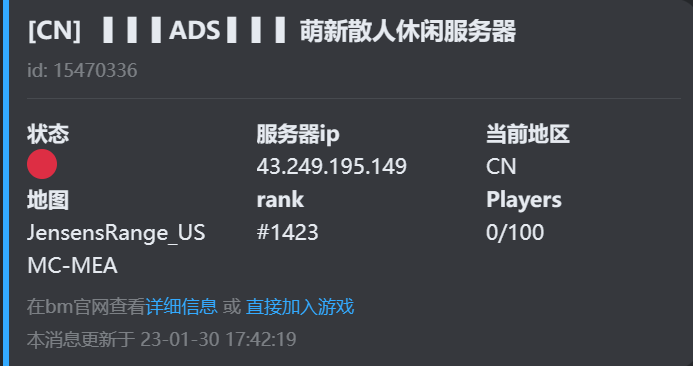

# Kook-BattleMetrics-Bot

A Kook-Bot to search BattleMetrics-Server

BattleMetrics是一个游戏服务器聚合网站，可以追踪并查询游戏服务器当前的信息

> BM官网：https://www.battlemetrics.com/

## 如何使用？

以下是BM-bot目前支持的命令操作

| 命令                            | 简介                                                         |
| ------------------------------- | ------------------------------------------------------------ |
| `/BMhelp`                       | 帮助命令，起这个名字是防止冲突                               |
| `/BM 萌新 hll 4`                | 显示游戏`hll`服务器中名称包含`萌新`的前4个结果               |
| `/py bm玩家id bm服务器id`       | 查询玩家在该服务器的游玩时间                                 |
| `/sv bm服务器id`                | 查询指定服务器的状态                                         |
| `/bmlk bm服务器id 个性化icon` | 自动在本频道更新指定服务器的信息，可传入icon-url让卡片带上你们服务器的专属头像 |
| `/td bm服务器id`                | 取消本频道对指定服务器的监看，如果不传入服务器id，则默认取消全部监看 |


结果示例图：




## 私有部署

### 依赖项

KOOK-Bot架构基于[khl.py](https://github.com/TWT233/khl.py/tree/main)，而访问BattleMetrics的api基于`aiohttp`

因为`khl.py`包含了`aiohttp`，所以只需要执行下面命令，安装`khl.py`包即可

~~~
pip install khl.py
~~~

注：安装之前请确保你的Python版本高于`3.7`

### config

在 `code/config`路径中添加`config.json`，并在里面填入以下内容来初始化你的Bot（连接方式为`websocket`）

```
{
    "token":"bot webhook/websocket token",
    "verify_token":"bot webhook verify token",
    "encrypt":"bot webhook encrypt token",
    "ws":true,
    "debug_ch": "debug channel id"
}
```

请务必删除掉`L18-24`和`botmarket`相关的内容。避免接口冲突！

https://github.com/Aewait/Kook-BattleMetrics-Bot/blob/a895e3cf73b5ac52cc247125b677e933a5d2cd7d/code/BMbot.py#L19-L25

### 运行bot

~~~
python3 BMbot.py
~~~

关于code里面的makefile，这是用于linux下快速启动bot后台运行的。如果你想在自己的linux服务器使用，请把里面的`py3`改成你自己云服务器上的python（就是用来命令行运行python程序的哪一个，如`python3`）

## 最后

如果你觉得本项目还不错，还请点个STAR✨

有任何问题，请添加`issue`，也欢迎加入我的交流服务器向我提出 [kook邀请链接](https://kook.top/gpbTwZ)
